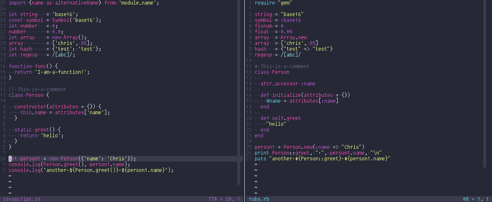

# Dracula for [vis](https://github.com/martanne/vis)

> A dark theme for [vis](https://github.com/martanne/vis)

## Install

All instructions can be found at [draculatheme.com/vis](https://draculatheme.com/vis).

## Team

This theme is maintained by the following person(s) and a bunch of [awesome contributors](https://github.com/dracula/vis/graphs/contributors).

|  |
| ---------------------------------------------------------------------------------------- |
| [milkknife](https://github.com/milkknife)                                               |

- **Original author**: [mikebarkmin](https://github.com/mikebarkmin)
- **Source**: [przmv/base16-vis](https://github.com/przmv/base16-vis#base16-dracula)

## Community

- [Twitter](https://twitter.com/draculatheme) - Best for getting updates about themes and new stuff.
- [GitHub](https://github.com/dracula/dracula-theme/discussions) - Best for asking questions and discussing issues.
- [Discord](https://draculatheme.com/discord-invite) - Best for hanging out with the community.

## License

[MIT License](./LICENSE)
